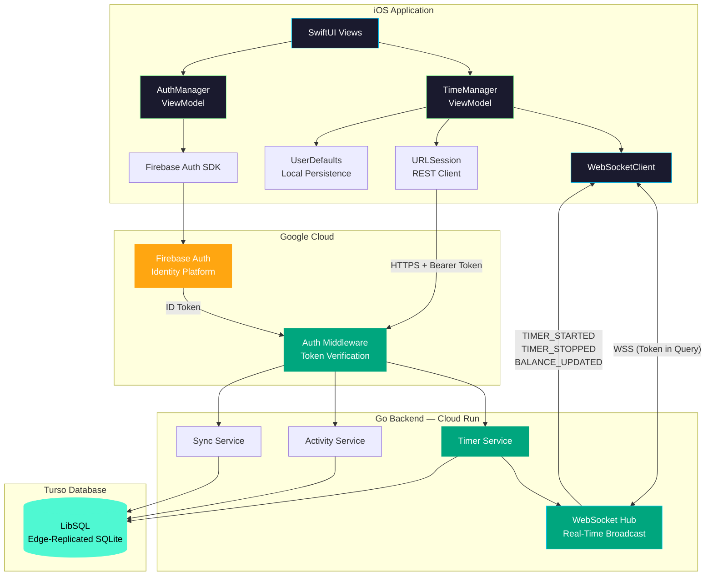
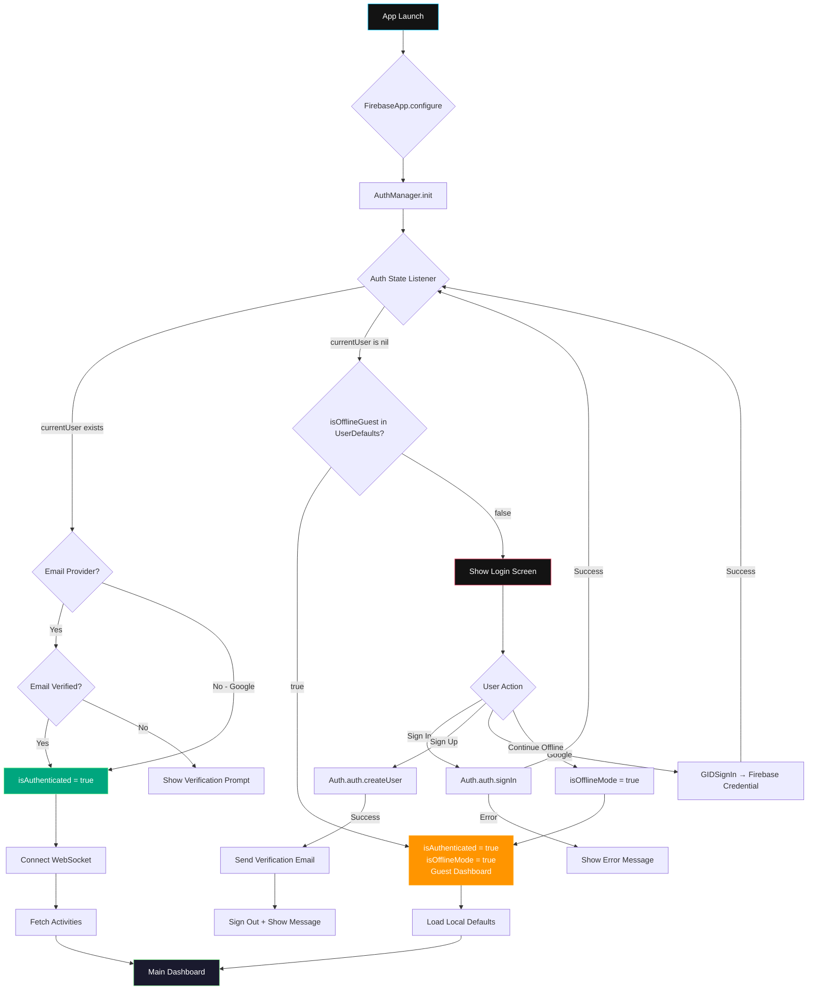

# Balance — iOS Application

> A **time-equity** system where users earn credits through productive activities and spend them on leisure — enforcing a conscious balance between growth and entertainment.


---

## Table of Contents

- [Tech Stack](#-tech-stack)
- [Project Structure](#-project-structure)
- [Architecture & Design](#-high-level-architecture--design-choices)
- [System Interconnectivity](#-system-interconnectivity)
- [API & WebSocket Structure](#-api--websocket-structure)
- [Firebase Authentication](#-firebase-authentication)
- [Offline Functionality](#-offline-functionality--guest-mode)
- [Environment Configuration](#-environment-configuration)
- [Getting Started](#-getting-started)

---

## Tech Stack

| Layer | Technology |
|---|---|
| **UI Framework** | SwiftUI (iOS 16+) |
| **Architecture** | MVVM (Model-View-ViewModel) |
| **Authentication** | Firebase Auth (Email/Password, Google Sign-In) |
| **Real-Time Sync** | `URLSessionWebSocketTask` + Combine |
| **Networking** | `URLSession` (async/await) |
| **State Management** | `@Published` + Combine pipelines |
| **Local Persistence** | `UserDefaults` (offline queues, balance, session state) |
| **Network Monitoring** | `NWPathMonitor` (Network framework) |
| **Notifications** | `UNUserNotificationCenter` (consume expiry alerts) |
| **Haptics** | `UIImpactFeedbackGenerator` / `UINotificationFeedbackGenerator` |
| **Backend** | Go (deployed on Google Cloud Run) |
| **Database** | Turso (LibSQL — edge-replicated SQLite) |

---

## Project Structure

```
Swift-Balance-App/
├── App/
│   └── Swift_Balance_AppApp.swift      # @main entry, Firebase init, scene lifecycle, splash routing
├── Models/
│   ├── AppState.swift                  # Enum: .idle, .toppingUp, .consuming
│   ├── ActivityProfile.swift           # Codable activity definition (id, name, category, icon)
│   ├── Config.swift                    # Environment toggle (Dev ↔ Production)
│   ├── Network.swift                   # APIConfig, WSEvent, OfflineSession, event payloads
│   └── SessionLog.swift               # Local session history entry
├── ViewModels/
│   ├── AuthManager.swift              # Firebase Auth lifecycle, Google Sign-In, guest mode
│   └── TimeManager.swift              # Core engine: dual-clock, delta calc, offline sync, lifecycle
├── Views/
│   ├── SplashView.swift               # Animated launch sequence
│   ├── LoginView.swift                # Email/password, Google, guest mode entry
│   ├── ContentView.swift              # Root TabView (Timer, History, Settings)
│   ├── TimerView.swift                # Main dashboard — balance display, activity cards, controls
│   ├── HistoryView.swift              # Session log timeline
│   └── ConfigurationView.swift        # Activity profile management, sign out / account upsell
├── Services/
│   ├── WebSocketClient.swift          # WS lifecycle, reconnection backoff, 25s keep-alive ping
│   └── NetworkMonitor.swift           # NWPathMonitor wrapper for device connectivity
└── Resources/
    └── Assets.xcassets/               # Colors, launch background
```

---

## High-Level Architecture & Design Choices

### MVVM Pattern

The app strictly follows **Model-View-ViewModel** separation:

- **Models** are pure `Codable` data structures with no business logic.
- **ViewModels** (`TimeManager`, `AuthManager`) are `ObservableObject` classes injected via `@EnvironmentObject`. They own all state mutations, networking, and persistence.
- **Views** are declarative SwiftUI structs that bind to `@Published` properties. Zero business logic in views.

### Dual-Clock Delta Engine

The core timing system uses a **client-side delta calculation** pattern. Rather than receiving a clock tick from the server every second:

1. The server sends `baseBalance` (CR snapshot) and `startTime` on `TIMER_STARTED`.
2. The client calculates elapsed time locally: `globalBalance = baseBalance ± elapsed`.
3. A 1-second Combine `Timer.publish` drives the UI tick via `deltaTick()`.

This provides **zero-latency UI updates** and continues working seamlessly when the app backgrounds or the WebSocket disconnects.

### Backgrounding Timestamp Catch-Up

When the app returns to foreground:

1. `handleForegrounded()` reads the persisted `sessionStartTime` from `UserDefaults`.
2. Recalculates `elapsed = Date() - sessionStartTime` to catch up on missed time.
3. Restarts the delta timer.
4. Reconnects the WebSocket and fetches the latest server state via `GET /api/timer/state`.
5. If the server reports a different state (e.g., another client stopped the timer), the server state wins.

### State Persistence Strategy

Critical state is persisted to `UserDefaults` so the app survives force-closes:

| Key | Purpose |
|---|---|
| `balance_timeBalance` | Current global CR balance |
| `balance_sessionLogs` | Local session history (JSON) |
| `balance_offlineQueue` | Pending offline sessions for sync |
| `balance_offlineActivitiesQueue` | Pending offline-created activities |
| `balance_activeSession*` | Active session snapshot (ID, start time, base balance, category) |
| `balance_guestActivities` | Guest mode activity profiles |
| `isOfflineGuest` | Whether the user is in offline/guest mode |

---

## System Interconnectivity

The Balance ecosystem consists of three components that work together:



### Data Flow Summary

| Flow | Protocol | Auth |
|---|---|---|
| iOS → Backend (REST) | HTTPS | `Authorization: Bearer <Firebase ID Token>` |
| iOS ↔ Backend (Real-Time) | WSS | Token passed as query parameter `?token=<ID Token>` |
| Backend → Turso | LibSQL HTTP | Service-level auth token |
| iOS → Firebase | Firebase SDK | Email/Password or Google OAuth |

---

## API & WebSocket Structure

### REST Endpoints

All endpoints require a valid Firebase ID token in the `Authorization: Bearer` header.

| Method | Endpoint | Purpose |
|---|---|---|
| `GET` | `/api/activities` | Fetch user's activity profiles |
| `POST` | `/api/activities` | Create a new activity profile |
| `POST` | `/api/activities/sync` | Bulk sync offline-created activities |
| `POST` | `/api/timer/start` | Start a timer session |
| `POST` | `/api/timer/stop` | Stop the active timer session |
| `GET` | `/api/timer/state` | Get current active session (if any) |
| `POST` | `/api/sync` | Bulk sync offline session logs |

### WebSocket Events

The iOS app connects to `wss://<host>/ws?token=<idToken>` with `X-Client-Type: iOS` header.

| Event | Direction | Payload | Purpose |
|---|---|---|---|
| `TIMER_STARTED` | Server → Client | `sessionID`, `activityID`, `activityName`, `activityCategory`, `startTime`, `baseBalance` | Initialize client-side delta calculation |
| `TIMER_STOPPED` | Server → Client | `sessionID`, `duration`, `creditsEarned` | Commit session log, reset UI to idle |
| `BALANCE_UPDATED` | Server → Client | `balance` | Sync global CR balance (guarded by offline queue shield) |

### WebSocket Lifecycle

```
App Launch / Foreground
    │
    ├── Auth.auth().currentUser exists?
    │       NO → Abort (guest mode or not logged in)
    │       YES ↓
    ├── Fetch Firebase ID Token (async)
    ├── Open WSS connection with token in URL query
    ├── Start 25s keep-alive ping timer (Combine Timer.publish)
    ├── Enter receive loop (continuous message listening)
    │
    ├── On message received → Decode WSEvent → Publish via eventSubject
    ├── On error → Cancel ping timer → Exponential backoff reconnect (1s → 30s cap)
    │
    └── On app background → disconnect() → cancel ping timer → persist session state
```

### Keep-Alive Ping

A **Combine `Timer.publish(every: 25.0)`** sends WebSocket pings to prevent Google Cloud Run's load balancer from terminating idle connections (~30s timeout). If a ping fails, the connection is assumed dead and the reconnect logic triggers.

---

## Firebase Authentication

### Supported Auth Methods

- **Email/Password** — with mandatory email verification for new accounts
- **Google Sign-In** — via `GoogleSignIn` SDK (no email verification required)
- **Guest Mode** — offline-only bypass with persisted state (`UserDefaults`)

### Authentication Lifecycle



### Token Management

- **`AuthManager.getIDToken()`** — static async method that fetches a fresh Firebase ID token for every REST/WS request.
- Tokens are **never cached** on the client — Firebase SDK handles refresh internally.
- The Go backend verifies tokens via Firebase Admin SDK middleware on every request.

---

## Offline Functionality & Guest Mode

### Guest Mode (No Account Required)

Users can tap **"Continue Offline (No Account)"** on the login screen to enter a fully functional local-only mode:

| Feature | Behavior in Guest Mode |
|---|---|
| **Activities** | 7 hardcoded defaults (4 top-up, 3 consume) + user-created profiles |
| **Timer** | Fully functional with local delta calculation |
| **Balance** | Tracked in `UserDefaults`, persists across launches |
| **Session History** | Logged locally to `UserDefaults` |
| **WebSocket** | Not connected (guarded by `Auth.auth().currentUser == nil`) |
| **REST API** | All network methods short-circuit with `guard !isGuestMode` |
| **Persistence** | `isOfflineGuest` flag in `UserDefaults` survives app restarts |
| **Upsell** | Settings shows "Create Account to Sync" → drops to login screen |

### CR Circuit Breaker

When a consuming session drains `globalBalance` to zero, the `deltaTick()` circuit breaker:
1. Force-stops the local session (`stopLocalOfflineSession()`).
2. Triggers heavy haptic feedback.
3. Shows an "Out of Time!" alert prompting the user to earn more credits.

### Two-Stage Offline Sync Pipeline

When an authenticated user reconnects after being offline:

```
WebSocket Connected (isConnectedToServer = true)
    │
    ├── Stage 1: POST /api/activities/sync
    │   └── Bulk upload offline-created ActivityProfiles
    │   └── Clear offlineActivitiesQueue on 200 OK
    │
    ├── Stage 2: POST /api/sync
    │   └── Bulk upload offline session logs (ISO8601 encoded)
    │   └── Clear offlineQueue on 200 OK
    │
    └── Stage 3: fetchActivities()
        └── Pull latest server state to reconcile
```

**Sync Shield:** While `offlineQueue` is non-empty, incoming `BALANCE_UPDATED` events from the server are ignored to prevent the server from overwriting local progress before sync completes.

---

## Environment Configuration

The `Config.swift` file provides a single toggle to switch between development and production:

```swift
enum Config {
    static let isProduction = true  // ← Flip this

    static var apiBaseURL: String {
        isProduction
            ? "https://balance-web-<id>.us-central1.run.app"
            : "http://localhost:3000"
    }

    static var wsBaseURL: String {
        isProduction
            ? "wss://balance-web-<id>.us-central1.run.app/ws"
            : "ws://localhost:3000/ws"
    }
}
```

All `APIConfig` endpoints and `WebSocketClient` derive their URLs from this single source.

---

## Getting Started

### Prerequisites

- **Xcode 15+** with iOS 16+ SDK
- **Firebase project** with Auth enabled (Email/Password + Google Sign-In)
- `GoogleService-Info.plist` placed in the `Swift-Balance-App/` directory
- Go backend running locally or deployed to Cloud Run

### Setup

```bash
# Clone the repository
git clone https://github.com/sethum-VS/Swift-Balance-App.git
cd Swift-Balance-App

# Open in Xcode
open Swift-Balance-App.xcodeproj

# Ensure GoogleService-Info.plist is in the project
# Configure signing with your Apple Developer team
# Build and run (⌘ + R)
```

### Environment Toggle

To switch between local development and production:

1. Open `Swift-Balance-App/Models/Config.swift`
2. Set `isProduction = false` for local dev, `true` for Cloud Run

---

## License

This project is proprietary software. All rights reserved.
